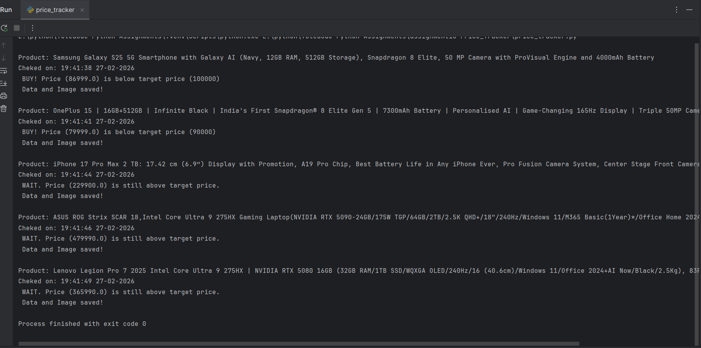
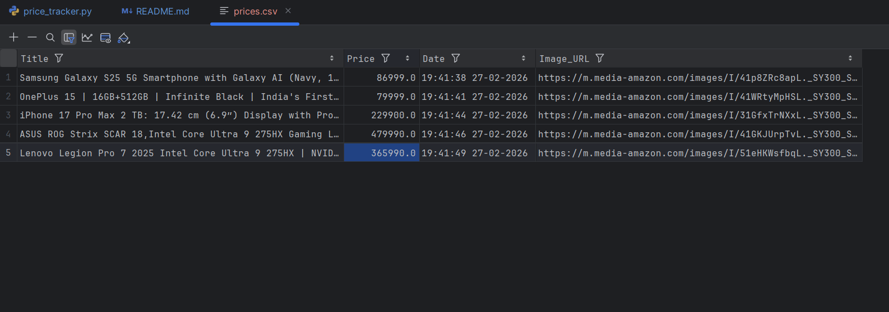
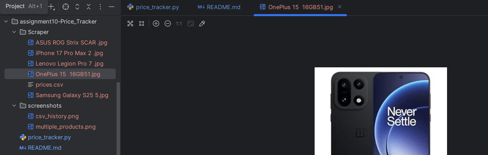

# Assignment 10: Web Scraping - Price Tracer

## Web Scraping Module Implementation

A complete Amazon price tracking application built using Python that scrapes multiple product information, compares prices against target values, saves historical data to CSV with timestamps, and downloads product images.

---

## 📌 Project Overview

### Description
A fully functional price tracking application that monitors multiple Amazon products simultaneously. The application extracts product title, price, and image URL, compares current prices with user-defined target prices, saves timestamped historical data to CSV for tracking, and downloads product images locally with organized storage.

### Features
- ✨ Multiple product tracking in single execution
- 💰 Real-time price extraction and comparison
- 🎯 Target price alerts (BUY/WAIT recommendations)
- 📝 CSV storage with timestamps for price history
- 🖼️ Automatic product image downloading
- 📁 Organized folder structure
- 🔄 Reusable PriceTracer class
- 🛡️ Custom User-Agent headers
- 📅 Datetime tracking for each check
- 🧹 Clean filename generation

---

## 📂 Project Structure
```
assignment10-Web_Scraping_Price_Tracer/
├── price_tracer.py               # Main price tracking application
├── Scraper/                      # Auto-generated output folder
│   ├── prices.csv               # CSV with timestamped price history
│   └── *.jpg                    # Downloaded product images
├── screenshots/
│   ├── multiple_products.png
│   ├── csv_history.png
│   └── downloaded_images.png
└── README.md                     # This documentation file
```

---

## 🚀 How to Run

### Prerequisites
- Python 3.x installed
- Required libraries

### Installation Steps

1. **Install required packages**:
```bash
pip install requests
pip install beautifulsoup4
pip install lxml
```

2. **Configure products to track**:
Edit the `products_to_track` list in `price_tracer.py`:
```python
products_to_track = [
    {"url": "AMAZON_PRODUCT_URL_1", "target": 100000},
    {"url": "AMAZON_PRODUCT_URL_2", "target": 90000},
]
```

3. **Run the application**:
```bash
python price_tracer.py
```

4. **Check output**:
- Console shows price comparison for each product
- CSV file created/updated in `Scraper/prices.csv` with timestamps
- Product images downloaded to `Scraper/` folder

---

## 💻 How It Works

1. **Initialize Tracker**: Create PriceTracer for each product URL
2. **Scrape Data**: Extract title, price, and image URL
3. **Compare Price**: Check against target price and show BUY/WAIT alert
4. **Add Timestamp**: Record exact date and time of check
5. **Save to CSV**: Append data with timestamp to CSV history
6. **Download Image**: Save product image with cleaned filename
7. **Repeat**: Process all products in the tracking list

---

## 📸 Screenshots

### Multiple Product Tracking


*Tracking multiple products simultaneously with BUY/WAIT alerts*

---

### CSV Price History with Timestamps

*Price tracking CSV file with historical data and timestamps*

---

### Downloaded Product Images


*Product images saved locally in Scraper folder*

---

## 🛠️ Technologies Used

- **Python 3.x**
- **requests 2.31.0** - HTTP library for web requests
- **BeautifulSoup4 4.12.0** - HTML parsing library
- **lxml 4.9.0** - High-performance parser
- **csv** - CSV file handling (built-in)
- **os** - File system operations (built-in)
- **datetime** - Timestamp generation (built-in)

---

## 💡 Learning Objectives

- Web scraping principles and techniques
- Making HTTP requests with custom headers
- Parsing HTML with BeautifulSoup
- Element selection strategies
- Data extraction and cleaning
- CSV file handling with timestamps
- Image downloading from URLs
- File system operations
- String manipulation techniques
- Object-oriented design
- Multi-product tracking systems
- Price comparison logic
- Datetime usage for tracking

---

## 📊 Data Structure

### CSV Columns
| Field | Type | Description | Example |
|-------|------|-------------|---------|
| Title | string | Product name | "Samsung Galaxy S25 Ultra..." |
| Price | float | Current price | 134999.0 |
| Date | string | Check timestamp | "14:30:22 21-02-2026" |
| Image_URL | string | Product image URL | "https://m.media-amazon.com/..." |

### Products Configuration
```python
products_to_track = [
    {"url": "product_url", "target": target_price},
]
```

---

## 🔮 Possible Enhancements

Future improvements that could be added:

### Features
- Email/SMS notifications for price drops
- Telegram bot integration
- Web dashboard for visualization
- Price history graphs
- Multiple e-commerce site support
- Product availability tracking

### Technical
- Database storage (SQLite/PostgreSQL)
- Scheduled automatic execution
- Proxy rotation for scaling
- Concurrent scraping with threading
- API endpoint for programmatic access
- Docker containerization

### Analytics
- Price trend analysis
- Best time to buy recommendations
- Price prediction using ML
- Historical low/high tracking
- Price drop percentage calculation

---

## 👤 Author

[Himanshu Arya]
Created as part of the TuteDude Python Programming Course

---

## 📄 License

This project is for educational purposes as part of the TuteDude Python course.