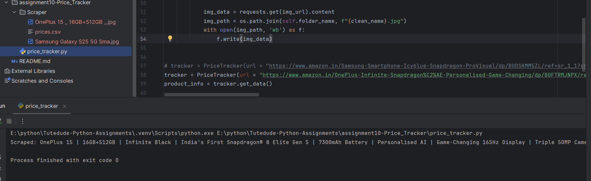
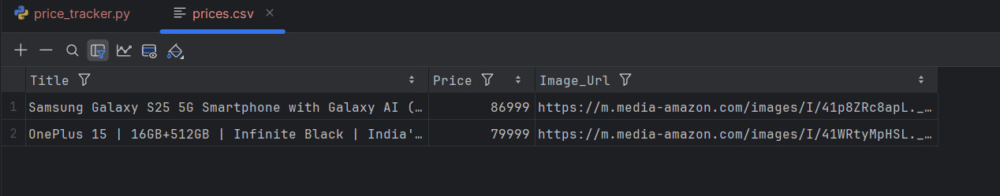
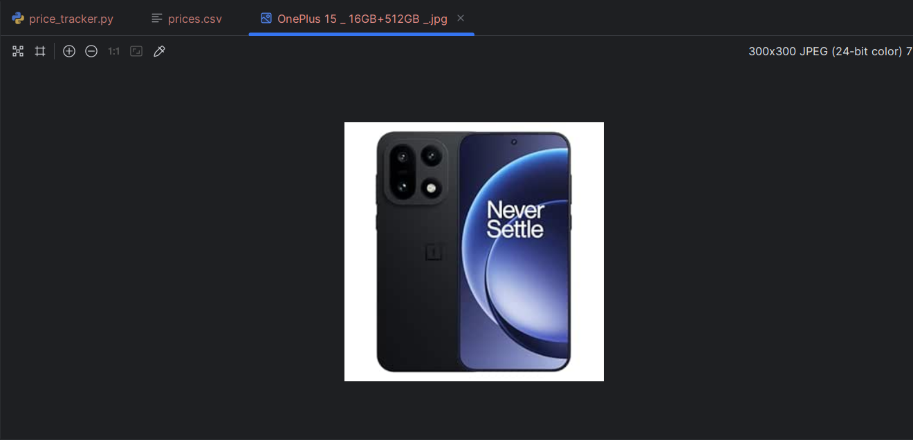

# Assignment 10: Web Scraping Implementation

## Web Scraping Module Implementation

A complete web scraping application built using Python to track product prices on Amazon. The application scrapes product information including title, price, and image, saves data to CSV, and downloads product images.

---

## 📌 Project Overview

### Description
A fully functional price tracker that scrapes product information from Amazon product pages. The application extracts product title, price, and image URL, saves the data to a CSV file for price tracking over time, and downloads product images locally.

### Features
- 🔍 Web scraping from Amazon product pages
- 💰 Price extraction and cleaning
- 📝 CSV file storage for price history
- 🖼️ Automatic product image downloading
- 📁 Organized folder structure
- 🔄 Reusable PriceTracker class
- 🛡️ Custom User-Agent headers
- ✨ Clean filename generation for images

---

## 📂 Project Structure
```
assignment10-Price_Tracker/
├── price_tracker.py           # Main web scraping application
├── Scraper/                   # Auto-generated folder for output
│   ├── prices.csv            # CSV file with product data
│   └── *.jpg                 # Downloaded product images
├── screenshots/
│   ├── scraped_data.png
│   ├── csv_output.png
│   └── downloaded_image.png
└── README.md                  # This documentation file
```

---

## 🚀 How to Run

### Prerequisites
- Python 3.x installed
- Required libraries

### Installation Steps

1. **Install required packages**:
```bash
pip install requests
pip install beautifulsoup4
pip install lxml
```

2. **Run the application**:
```bash
python price_tracker.py
```

3. **Check output**:
- CSV file will be created/updated in `Scraper/prices.csv`
- Product image will be downloaded to `Scraper/` folder

---

## 💻 How It Works

1. **Initialize Tracker**: Create PriceTracker object with Amazon product URL
2. **Scrape Data**: Extract product title, price, and image URL from the page
3. **Clean Price**: Remove formatting characters (commas, periods) and convert to integer
4. **Save to CSV**: Append product data to CSV file (creates file if it doesn't exist)
5. **Download Image**: Save product image with cleaned filename
6. **Console Output**: Print scraped product title

---

## 📸 Screenshots

### Scraped Product Data


*Console output showing scraped product information*

---

### CSV Output


*Price tracking CSV file with product details*

---

### Downloaded Product Image


*Product image saved locally*

---

## 🛠️ Technologies Used

- **Python 3.x**
- **requests** - HTTP library for making web requests
- **BeautifulSoup4** - HTML parsing library
- **lxml** - XML/HTML parser
- **csv** - CSV file handling (built-in)
- **os** - File system operations (built-in)

---

## 🔧 Class Methods

### PriceTracker Class

#### `__init__(self, url)`
- Initializes the tracker with target URL
- Sets up User-Agent headers
- Creates `Scraper` folder if it doesn't exist
- Makes HTTP request and parses HTML

#### `get_data(self)`
- Extracts product title from page
- Extracts and cleans price (removes commas and periods)
- Extracts product image URL
- Returns dictionary with scraped data

#### `save_to_csv(self, data)`
- Saves product data to CSV file
- Creates CSV with headers if file doesn't exist
- Appends new data to existing CSV

#### `download_image(self, img_url, name)`
- Downloads product image from URL
- Cleans filename (removes invalid characters)
- Truncates filename to 25 characters
- Saves image as JPG in Scraper folder

---

## 🔑 Key Concepts Implemented

### Web Scraping Fundamentals
- Making HTTP requests with custom headers
- Parsing HTML with BeautifulSoup
- Finding elements by ID and class
- Extracting text and attributes from HTML tags

### Data Processing
- String cleaning and formatting
- Type conversion (string to integer)
- Filename sanitization
- CSV file handling

### File Operations
- Creating directories programmatically
- Checking if files exist
- Reading and writing CSV files
- Downloading and saving binary data (images)

### Object-Oriented Programming
- Class-based architecture
- Instance methods
- Constructor initialization
- Encapsulation of functionality

---

## 💡 Learning Objectives

- Understanding web scraping principles
- Making HTTP requests with custom headers
- Parsing HTML content with BeautifulSoup
- Selecting elements using ID and class selectors
- Extracting and cleaning data
- Working with CSV files in append mode
- Downloading images from web
- File system operations in Python
- String manipulation and cleaning
- Object-oriented design patterns

---

## 📊 Data Extracted

| Field | Description | Example |
|-------|-------------|---------|
| Title | Product name | "Samsung Galaxy S25 Ultra..." |
| Price | Clean integer price | 134999 |
| Image_Url | Product image URL | "https://m.media-amazon.com/..." |

---

## 🔍 Technical Details

### User-Agent Header
```python
"User-Agent": "Mozilla/5.0 (Windows NT 10.0; Win64; x64) AppleWebKit/537.36..."
```
- Mimics browser request to avoid blocking
- Essential for successful scraping

### Price Cleaning
```python
price_clean = int(price.replace(',', '').replace('.', ''))
```
- Removes comma separators
- Removes decimal points
- Converts to integer for numerical operations

### Filename Sanitization
```python
clean_name = "".join([c if c not in '<>:"/\\|?*' else "_" for c in name])
clean_name = clean_name[:25]
```
- Removes invalid filename characters
- Replaces with underscores
- Limits length to 25 characters

---

## 📁 Files

- `price_tracker.py` - Main application with PriceTracker class
- `Scraper/prices.csv` - CSV file with scraped product data
- `Scraper/*.jpg` - Downloaded product images
- `README.md` - This documentation file
- `screenshots/` - Application screenshots

---

## 📦 Requirements.txt
```
requests==2.31.0
beautifulsoup4==4.12.0
lxml==4.9.0
```

---

## 🎯 Use Cases

- **Price Monitoring**: Track price changes over time
- **Data Collection**: Gather product information for analysis
- **Comparison Shopping**: Compare prices across different products
- **Market Research**: Analyze pricing trends
- **Automated Tracking**: Run periodically to build price history

---

## 🔮 Possible Enhancements

Future improvements that could be added:
- Multiple product tracking
- Price change alerts
- Email notifications when price drops
- Scheduled automatic scraping
- Price history visualization
- Database storage instead of CSV
- Support for multiple e-commerce sites
- Price comparison features

---

## ⚠️ Important Notes

- **Respect robots.txt**: Always check website's scraping policy
- **Rate Limiting**: Don't make too many requests too quickly
- **User-Agent Required**: Amazon may block requests without proper headers
- **HTML Structure Changes**: Website updates may break selectors
- **Legal Compliance**: Use scraped data responsibly and legally

---

## 🧪 Testing with Different Products

To scrape a different product:

1. Copy Amazon product URL
2. Replace the URL in the tracker initialization:
```python
tracker = PriceTracker(url="YOUR_AMAZON_PRODUCT_URL")
```
3. Run the script

---

## 👤 Author

[Himanshu Arya]  
Created as part of the TuteDude Python Programming Course

---

## 📄 License

This project is for educational purposes as part of the TuteDude Python course.