# Assignment 11: Computer Vision with OpenCV

## OpenCV - Image and Video Processing

A comprehensive collection of computer vision applications built using OpenCV (cv2) demonstrating various image processing techniques, transformations, filters, and video recording capabilities.

---

## 📌 Project Overview

### Description
A fully functional computer vision project that demonstrates multiple image processing operations including resizing, morphological transformations, flipping, shifting, rotation, thresholding, edge detection, blurring filters, and video recording/playback from webcam.

### Features
- 📐 Image resizing with aspect ratio maintenance
- 🔄 Morphological operations (Erosion, Dilation, Opening, Closing, Gradient, Top Hat, Black Hat)
- 🔃 Image flipping (Vertical, Horizontal, Both)
- 📍 Image shifting and rotation
- 🎯 Binary thresholding and edge detection
- 🌫️ Blurs (Gaussian, Median) & Filter (Bilateral) 
- 📹 Video recording from webcam
- 💾 Video saving with custom overlays
- ▶️ Video playback

---

## 📂 Project Structure
```
assignment-OpenCV/
├── image.py                      # Image reading, resizing, and writing
├── morph.py                      # Morphological operations
├── flip.py                       # Image flipping with text labels
├── shift_rotate.py               # Image shifting and rotation
├── thres_edge.py                 # Thresholding and edge detection
├── blur_filter.py                # Blur and filter operations
├── video.py                      # Webcam recording and playback
├── dragon.jpg                    # Sample input image
├── Output.mp4                    # Recorded video output (generated)
├── screenshots/
│   ├── blur_filter_output.png
│   ├── flip_output.png
│   ├── image_output.png
│   ├── morph_output1.png
│   ├── morph_output2.png
│   ├── morph_output3.png
│   ├── morph_output4.png
│   ├── shift_rotate_output.png
│   ├── thres_edge_output.png
│   ├── video_output1.png
│   └── video_output2.png
└── README.md                     # This documentation file
```

---

## 🚀 How to Run

### Prerequisites
- Python 3.x installed
- OpenCV library
- NumPy library
- Webcam (for video recording)

### Installation Steps

1. **Install required packages**:
```bash
pip install opencv-python
pip install numpy
```

2. **Prepare input image**:
- Place an image named `dragon.jpg` in the project folder
- Or update the file path in the code

3. **Run individual scripts**:
```bash
# Image resizing
python image.py

# Morphological operations
python morph.py

# Image flipping
python flip.py

# Shifting and rotation
python shift_rotate.py

# Thresholding and edge detection
python thres_edge.py

# Blur filters
python blur_filter.py

# Video recording (requires webcam)
python video.py
```

---

## 📸 Screenshots

### Original and Resized Image
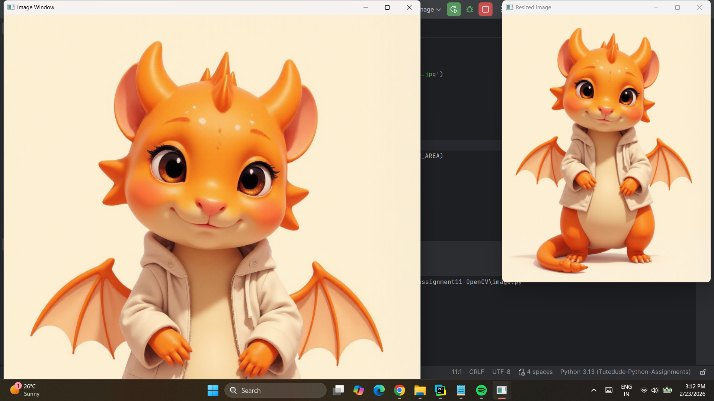

*Original image and 50% scaled version maintaining aspect ratio*

---

### Morphological Operations
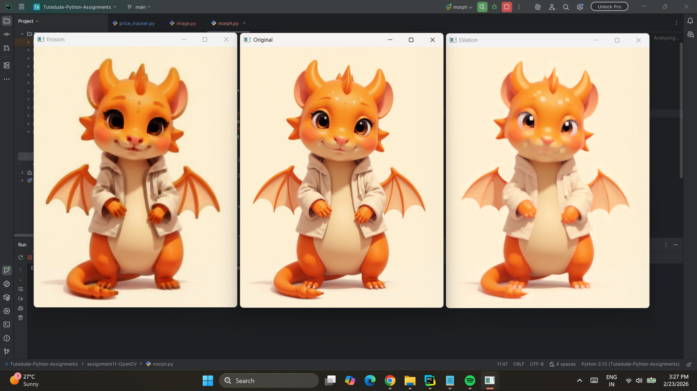

*Erosion, Dilation*

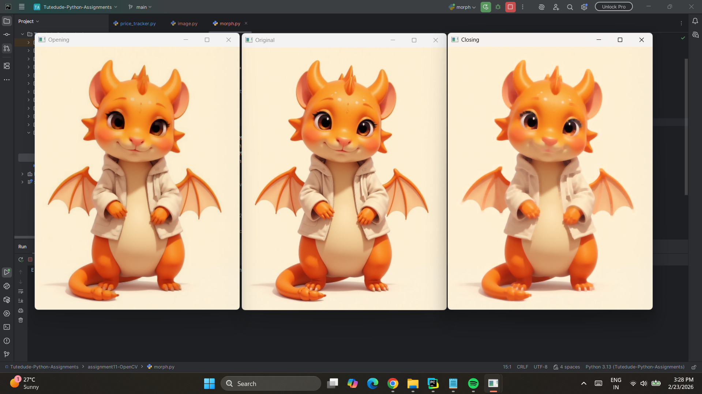

*Opening, Closing*

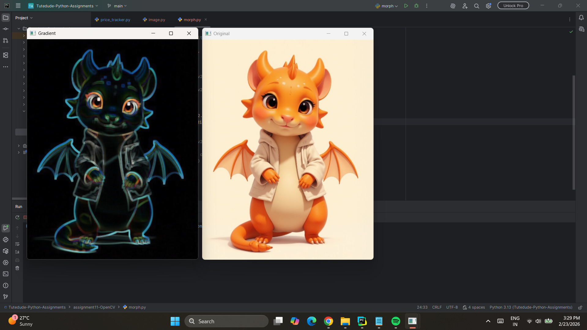

Gradient*

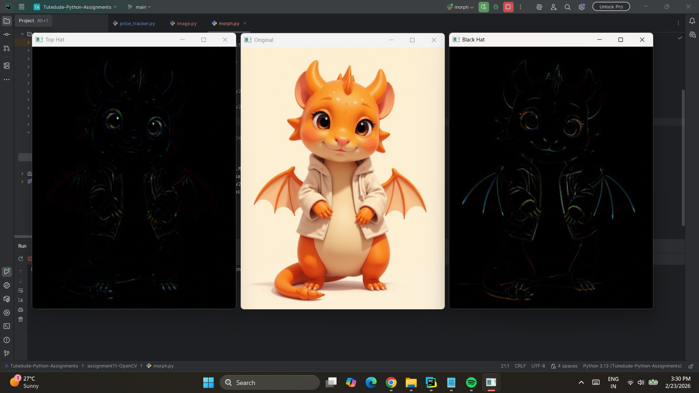

*Top Hat, and Black Hat*

---

### Flipped Images
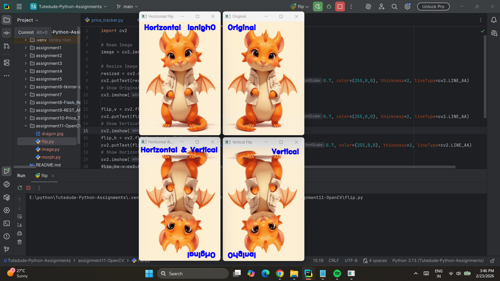

*Vertical, Horizontal, and Both flips with text labels*

---

### Shifted and Rotated
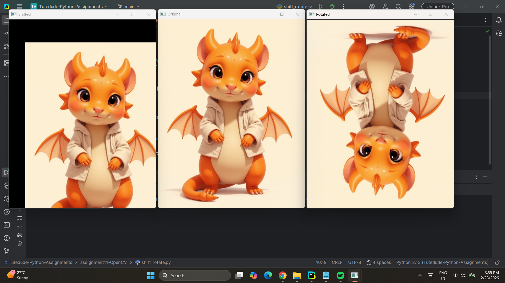

*Image shifting and 180-degree rotation*

---

### Threshold and Edge Detection
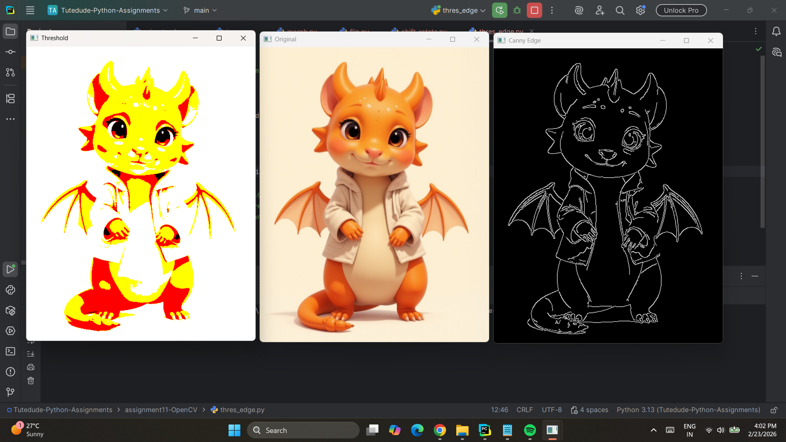

*Binary threshold and Canny edge detection results*

---

### Blur and Filters
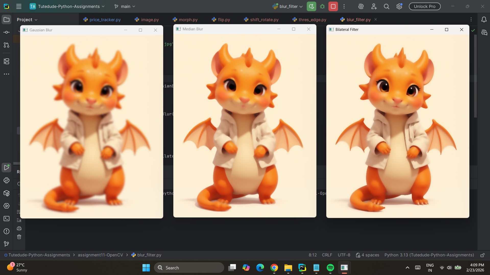

*Gaussian, Median, and Bilateral filtering effects*

---

### Video Recording
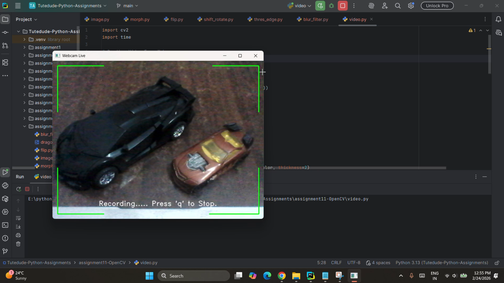

*Webcam recording with corner frames and text overlay*

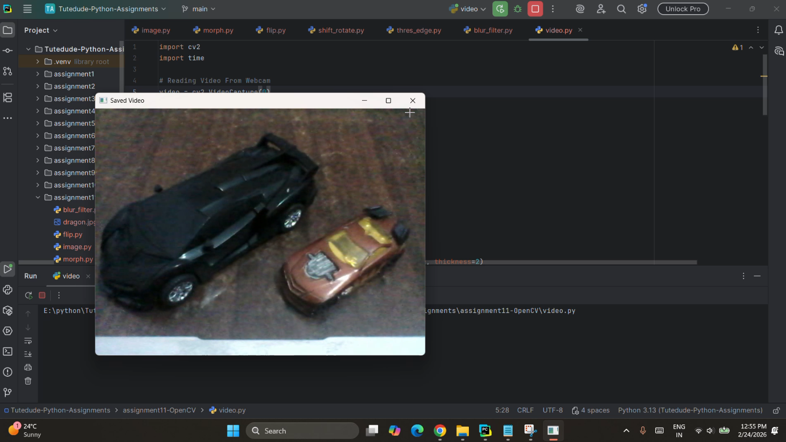

*Recorded video playback*

---

## 🛠️ Technologies Used

- **Python 3.x**
- **OpenCV (cv2) 4.x** - Computer vision library
- **NumPy** - Numerical operations
- **Built-in libraries:**
  - time - Timing operations

---

## 🔧 Key OpenCV Functions

### Image I/O
- `cv2.imread()` - Read image from file
- `cv2.imwrite()` - Write image to file
- `cv2.imshow()` - Display image window
- `cv2.waitKey()` - Wait for key press
- `cv2.destroyAllWindows()` - Close all windows

### Image Transformations
- `cv2.resize()` - Resize image
- `cv2.flip()` - Flip image
- `cv2.warpAffine()` - Apply affine transformation
- `cv2.getRotationMatrix2D()` - Create rotation matrix

### Morphological Operations
- `cv2.erode()` - Erosion
- `cv2.dilate()` - Dilation
- `cv2.morphologyEx()` - Advanced morphology

### Filters and Smoothing
- `cv2.GaussianBlur()` - Gaussian blur
- `cv2.medianBlur()` - Median blur
- `cv2.bilateralFilter()` - Bilateral filter

### Edge Detection and Thresholding
- `cv2.threshold()` - Binary thresholding
- `cv2.Canny()` - Edge detection

### Drawing Functions
- `cv2.line()` - Draw lines
- `cv2.putText()` - Add text
- `cv2.circle()` - Draw circles
- `cv2.rectangle()` - Draw rectangles

### Video Operations
- `cv2.VideoCapture()` - Capture video
- `cv2.VideoWriter()` - Write video
- `cv2.VideoWriter_fourcc()` - Codec

---

## 💡 Learning Objectives

- Understanding OpenCV library fundamentals
- Image reading, writing, and display
- Image resizing and scaling techniques
- Morphological image processing
- Geometric transformations
- Thresholding and segmentation
- Edge detection algorithms
- Smoothing and filtering techniques
- Video capture from webcam
- Video encoding and saving
- Real-time video processing
- Drawing shapes and adding text
- Frame-by-frame manipulation

---

## 📁 Files

- `image.py` - Image reading, resizing with aspect ratio, and saving
- `morph.py` - Complete morphological operations demonstration
- `flip.py` - Image flipping in all directions with labels
- `shift_rotate.py` - Image transformation operations
- `thres_edge.py` - Thresholding and edge detection
- `blur_filter.py` - Various blur and filter techniques
- `video.py` - Webcam recording with overlays and playback
- `dragon.jpg` - Sample input image
- `Output.mp4` - Generated video output
- `README.md` - This documentation file
- `screenshots/` - Operation result screenshots

---

## 🔮 Possible Enhancements

Future improvements that could be added:

### Image Processing
- Color space conversions (RGB, HSV, Grayscale)
- Histogram equalization
- Contour detection
- Shape recognition
- Template matching

### Video Processing
- Object tracking
- Motion detection
- Face detection
- Real-time filtering
- Video stabilization

### Advanced Features
- Machine learning integration
- Deep learning models
- Image classification
- Object detection with YOLO/SSD
- Facial recognition

---

## 🐛 Troubleshooting

### Common Issues

**Issue: "File not found"**
- Solution: Check image path in code, use absolute path

**Issue: "Webcam not accessible"**
- Solution: Check camera permissions, ensure no other app is using it

**Issue: "Video codec error"**
- Solution: Try different fourcc codec (e.g., 'XVID', 'MJPG')

**Issue: "Import error: cv2"**
- Solution: Install OpenCV with `pip install opencv-python`

---

## 👤 Author

[Himanshu Arya]  
Created as part of the TuteDude Python Programming Course

---

## 📄 License

This project is for educational purposes as part of the TuteDude Python course.