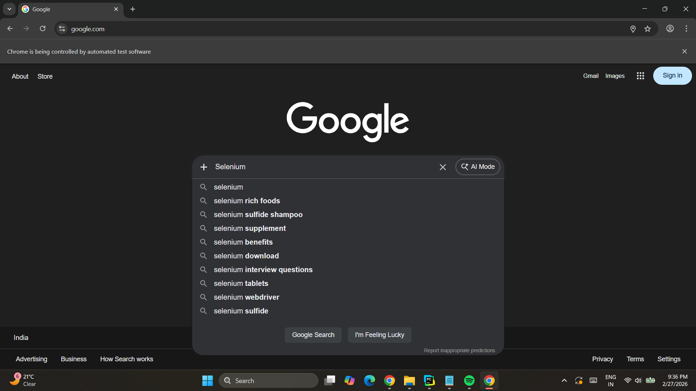
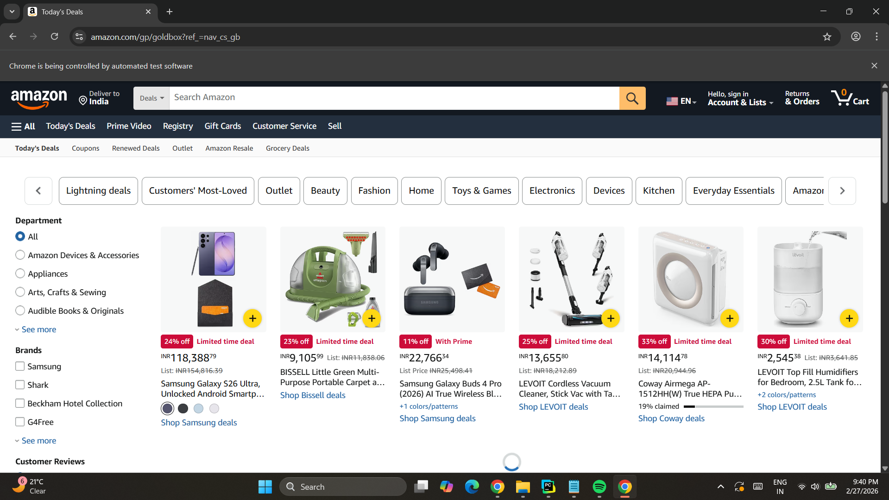
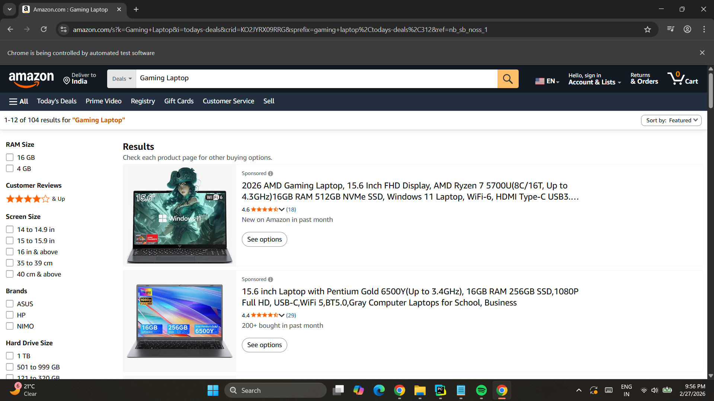
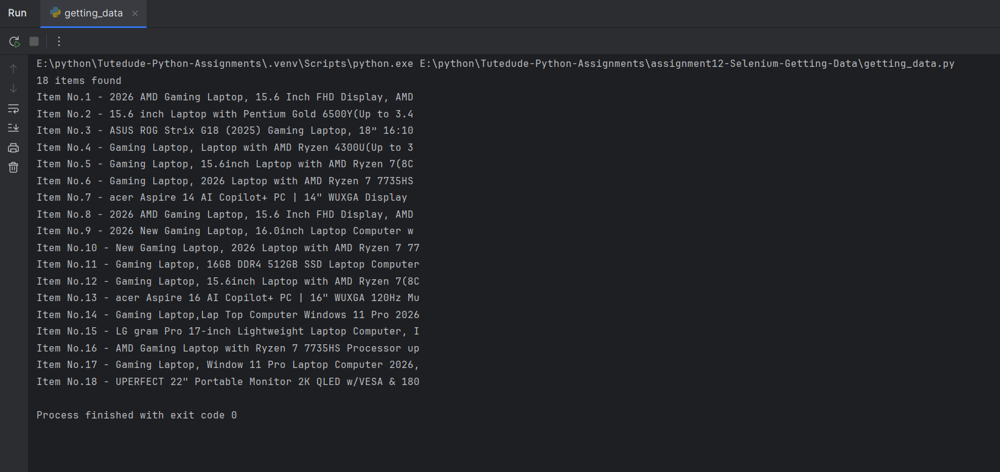

# Assignment 12: Automation Using Selenium - Getting Data

## Automation Using Selenium: Getting Data

A complete web automation script built using Selenium WebDriver that demonstrates automated web browsing, searching, navigation, and data extraction from Amazon product listings.

---

## 📌 Project Overview

### Description
A fully functional web automation application that uses Selenium to automate browser interactions including Google search, Amazon navigation, product search, and data extraction. The script demonstrates various element selection methods and automated user interactions.

### Features
- 🌐 Automated browser control with Chrome WebDriver
- 🔍 Google search automation
- 🛒 Amazon website navigation
- 🔗 Link clicking and page navigation
- 🔙 Browser back navigation
- 🔄 Page refresh automation
- 📝 Form input automation
- 🎯 Multiple element location strategies (ID, Name, Class, Link Text, XPath)
- 📊 Data extraction from multiple elements
- ⏱️ Timed operations with sleep delays
- 🖥️ Window maximization
- 🔢 Product counting and enumeration

---

## 📂 Project Structure
```
assignment12-Automation_Using_Selenium/
├── getting_data.py                   # Main Selenium automation script
├── screenshots/
│   ├── google_search.png
│   ├── amazon_navigation.png
│   ├── product_search.png
│   └── console_output.png
└── README.md                     # This documentation file
```

---

## 🚀 How to Run

### Prerequisites
- Python 3.x installed
- Google Chrome browser installed
- Selenium WebDriver

### Installation Steps

1. **Install Selenium**:
```bash
pip install selenium
```

2. **Run the automation script**:
```bash
python facebook.py
```

3. **Watch the automation**:
   - Chrome browser will open automatically
   - Script will perform automated actions
   - Console will display extracted product data
   - Browser will close automatically after completion

**Note:** Selenium 4.6+ automatically manages ChromeDriver, so no manual driver download is needed!

---

## 💻 Script Workflow

### Step 1: Browser Initialization
```python
driver = webdriver.Chrome()
driver.maximize_window()
```
- Creates Chrome WebDriver instance
- Maximizes browser window

### Step 2: Google Search
```python
driver.get("https://www.google.com")
textarea = driver.find_element(By.NAME, "q")
textarea.send_keys("Selenium")
textarea.send_keys(Keys.RETURN)
```
- Navigates to Google
- Finds search box by name
- Types "Selenium" and searches

### Step 3: Navigation
```python
driver.back()
```
- Goes back to previous page

### Step 4: Amazon Navigation
```python
driver.get("https://www.amazon.com")
driver.find_element(By.CLASS_NAME, "a-button-input").click()
driver.find_element(By.LINK_TEXT, "Today's Deals").click()
driver.refresh()
```
- Opens Amazon
- Clicks button by class name
- Clicks "Today's Deals" link
- Refreshes page

### Step 5: Product Search
```python
driver.find_element(By.XPATH, '//input[@id="twotabsearchtextbox"]').send_keys("Gaming Laptop")
driver.find_element(By.XPATH, '//input[@id="nav-search-submit-button"]').click()
```
- Finds search box using XPath
- Types "Gaming Laptop"
- Clicks search button

### Step 6: Data Extraction
```python
items = driver.find_elements(By.XPATH, '//h2[@class="a-size-medium a-spacing-none a-color-base a-text-normal"]')
total = len(items)
for item in items:
    print(f"Item No.{j} - {item.text[:50]}")
```
- Extracts all product titles
- Counts total items
- Prints each item with number (first 50 chars)

---

## 📸 Screenshots

### Google Search Automation


*Automated search on Google with "Selenium" keyword*

---

### Amazon Navigation


*Automated navigation through Amazon pages*

---

### Product Search Results


*Gaming laptop search results on Amazon*

---

### Console Output - Extracted Data


*Console showing extracted product titles and count*

---

## 🛠️ Technologies Used

- **Python 3.x**
- **Selenium WebDriver 4.x** - Browser automation framework
- **ChromeDriver** - Chrome browser driver (auto-managed)
- **time** - Timing and delays (built-in)

---

## 🔧 Element Location Strategies

### By.NAME
```python
driver.find_element(By.NAME, "q")
```
- Locates element by name attribute
- Used for Google search box
- Fast and reliable for form inputs

### By.CLASS_NAME
```python
driver.find_element(By.CLASS_NAME, "a-button-input")
```
- Locates element by CSS class
- Used for Amazon buttons
- Good for styled elements

### By.LINK_TEXT
```python
driver.find_element(By.LINK_TEXT, "Today's Deals")
```
- Locates link by exact text
- Used for navigation links
- Most readable for links

### By.XPATH
```python
driver.find_element(By.XPATH, '//input[@id="twotabsearchtextbox"]')
driver.find_elements(By.XPATH, '//h2[@class="a-size-medium..."]')
```
- Locates elements using XPath expression
- Most flexible location strategy
- Used for search boxes and product titles
- Can find single or multiple elements

---

## 🔑 Key Concepts Implemented

### Selenium WebDriver Basics
- WebDriver initialization
- Browser window control (maximize)
- Page navigation (get, back, refresh)
- Browser quit operation

### Element Interaction
- Finding single elements (`find_element`)
- Finding multiple elements (`find_elements`)
- Sending text to input fields (`send_keys`)
- Clicking elements (`click`)
- Sending keyboard keys (Keys.RETURN)

### Data Extraction
- Extracting text from elements
- Counting elements with `len()`
- Iterating through element lists
- String truncation for display ([:50])
- Enumeration with counter logic

### Timing and Synchronization
- Using `time.sleep()` for delays
- Waiting for page loads
- Preventing race conditions

---

## 💡 Learning Objectives

- Setting up Selenium WebDriver with Chrome
- Automating browser navigation
- Locating web elements using different strategies
- Interacting with form inputs and buttons
- Simulating keyboard actions
- Extracting data from web pages
- Handling multiple elements
- Managing browser windows
- Using explicit waits with time.sleep()
- Building end-to-end automation workflows
- Data extraction and processing

---

## 📊 Sample Output
```
24 items found
Item No.1 - ASUS TUF Gaming F15, 15.6" (39.62 cms) FHD 144Hz
Item No.2 - Lenovo IdeaPad Gaming 3 Laptop AMD Ryzen 5 5500H
Item No.3 - HP Victus Gaming Laptop, AMD Ryzen 5 5600H 6-cor
Item No.4 - Acer Nitro V Gaming Laptop 13th Gen Intel Core i
Item No.5 - MSI Thin 15, Intel 12th Gen. i5-12450H, 40CM FHD
...
Item No.24 - Dell G15 5530 Gaming Laptop, Intel Core i5-1345
```

---

## 📁 Files

- `getting_data.py` - Main Selenium automation script with all automation logic
- `README.md` - This documentation file
- `screenshots/` - Folder containing automation screenshots

---

## 🎯 Automation Steps

| Step | Action | Method |
|------|--------|--------|
| 1 | Open Chrome | `webdriver.Chrome()` |
| 2 | Maximize window | `driver.maximize_window()` |
| 3 | Go to Google | `driver.get()` |
| 4 | Find search box | `find_element(By.NAME)` |
| 5 | Type search | `send_keys()` |
| 6 | Submit search | `send_keys(Keys.RETURN)` |
| 7 | Go back | `driver.back()` |
| 8 | Open Amazon | `driver.get()` |
| 9 | Click button | `find_element(By.CLASS_NAME).click()` |
| 10 | Click link | `find_element(By.LINK_TEXT).click()` |
| 11 | Refresh page | `driver.refresh()` |
| 12 | Search products | `find_element(By.XPATH).send_keys()` |
| 13 | Extract data | `find_elements()` |
| 14 | Count items | `len()` |
| 15 | Display results | `print()` loop |
| 16 | Close browser | `driver.quit()` |

---

## 🔍 XPath Expressions

### Search Box
```xpath
//input[@id="twotabsearchtextbox"]
```
- Finds input element with specific id
- Absolute selector for search box

### Search Button
```xpath
//input[@id="nav-search-submit-button"]
```
- Finds submit button by id
- Ensures correct button is clicked

### Product Titles
```xpath
//h2[@class="a-size-medium a-spacing-none a-color-base a-text-normal"]
```
- Finds all h2 elements with specific class
- Returns list of product title elements
- Used for data extraction

---

## 🔮 Possible Enhancements

Future improvements that could be added:

### Features
- Save extracted data to CSV
- Price extraction and comparison
- Rating and review extraction
- Product availability checking
- Multiple page scraping

### Technical
- Explicit waits instead of sleep
- Error handling and recovery
- Headless browser mode
- Logging implementation
- Screenshot capture on errors

### Data Processing
- Export to Excel/JSON
- Data cleaning and formatting
- Database storage
- Price tracking over time
- Generate comparison reports

---

## 👤 Author

[Himanshu Arya]  
Created as part of the TuteDude Python Programming Course

---

## 📄 License

This project is for educational purposes as part of the TuteDude Python course.