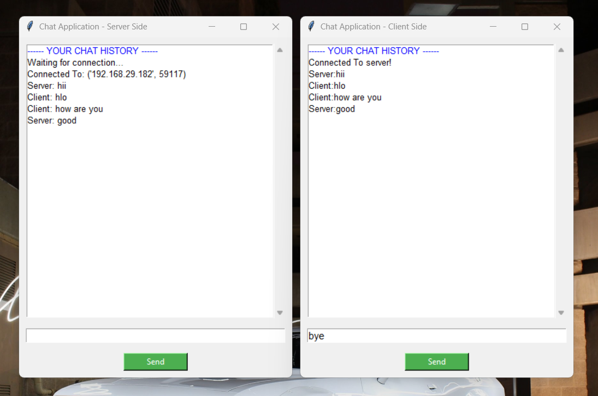

# Assignment 14: Network Programming - Chat Application

## Network Programming In Python Using Sockets: Building A Chat Application

A complete client-server chat application built using Python sockets and Tkinter GUI that enables real-time text communication between two users on the same network.

---

## 📌 Project Overview

### Description
A fully functional chat application that uses socket programming for network communication and Tkinter for the graphical user interface. The application consists of a server and client that can exchange messages in real-time over a local network connection with automatic message receiving through threading.

### Features
- 💬 Real-time messaging between server and client
- 🖥️ User-friendly GUI with Tkinter
- 📜 Chat history display with scrollbar
- 🎨 Color-coded header message
- 🔘 Send button for message transmission
- 📡 Socket-based network communication
- 🔌 TCP/IP protocol implementation
- 🧵 Threading for automatic message receiving
- 👋 "bye" command for graceful exit
- ⚠️ Error handling with message boxes
- 🔒 Proper socket cleanup on exit

---

## 📂 Project Structure
```
assignment14-Chat_Application/
├── server.py                     # Server-side chat application
├── client.py                     # Client-side chat application
├── screenshots/
│   ├── screen_recording_assignment-14.mp4
│   └── chat_conversation.png
└── README.md                     # This documentation file
```

---

## 🚀 How to Run

### Prerequisites
- Python 3.x installed
- Tkinter (usually comes pre-installed with Python)
- Both computers must be on the same network

### Running the Application

**Step 1: Start the Server**
```bash
python server.py
```
- Server window will open
- Shows "Waiting for connection..." message
- Server must be started first!

**Step 2: Start the Client**
```bash
python client.py
```
- Client window will open
- Automatically connects to server
- Shows "Connected To server!" message
- Chat is now ready!

### Usage
1. Type your message in the text entry box at the bottom
2. Click "Send" button to send the message
3. Messages automatically appear in the chat history
4. Type "bye" to close the chat gracefully
5. Both windows will close when "bye" is sent

---

## 💻 How It Works

### Server Side (server.py)
1. Creates a socket and binds to host and port (12345)
2. Listens for incoming client connections with `listen(1)`
3. Accepts client connection with `accept()`
4. Opens GUI window with chat interface
5. Starts background thread for automatic message receiving
6. Sends messages when Send button is clicked
7. Closes connection when "bye" is received or sent

### Client Side (client.py)
1. Creates a socket
2. Connects to server using hostname and port (12345)
3. Opens GUI window with chat interface
4. Starts background thread for automatic message receiving
5. Sends messages when Send button is clicked
6. Closes connection when "bye" is received or sent

### Communication Flow
```
Server                          Client
  |                               |
  |--- Waiting for Connection ----|
  |                               |
  |<------ Connection Request ----|
  |                               |
  |------- Accept Connection ---->|
  |                               |
  |<====== Real-time Messages ====>|
  |        (via Threading)        |
  |                               |
  |<-------- "bye" message --------|
  |                               |
  |---- Close Connection -------->|
```

---

## 📸 Screenshots

### Chat Conversation


*Real-time message exchange between server and client*

---

## 🛠️ Technologies Used

- **Python 3.x**
- **socket** - Network communication (built-in)
- **threading** - Background message receiving (built-in)
- **Tkinter** - GUI framework (built-in)

---

## 🔧 Socket Configuration

### Server Configuration
```python
s = socket.socket(socket.AF_INET, socket.SOCK_STREAM)
host_name = socket.gethostname()  # Gets computer name
port = 12345                       # Port number
s.bind((host_name, port))         # Bind to address
s.listen(1)                        # Listen for 1 connection
client, address = s.accept()      # Accept connection
```

### Client Configuration
```python
s = socket.socket(socket.AF_INET, socket.SOCK_STREAM)
host_name = socket.gethostname()  # Gets computer name
port = 12345                       # Same port as server
s.connect((host_name, port))      # Connect to server
```

---

## 🧵 Threading Implementation

### Server Thread
```python
thread = threading.Thread(target=receive)
thread.daemon = True
thread.start()
```

### Client Thread
```python
thread = threading.Thread(target=receive)
thread.daemon = True
thread.start()
```

**Purpose:**
- Runs `receive()` function in background
- Continuously listens for incoming messages
- Daemon thread closes when main program exits
- Enables real-time message receiving

---

## 🔑 Key Concepts Implemented

### Network Programming
- TCP/IP socket creation
- Socket binding and listening
- Client-server connection
- Message encoding/decoding
- Socket closing and cleanup

### Threading
- Background thread for message receiving
- Daemon threads for automatic cleanup
- Continuous message listening
- Thread-safe GUI updates

### GUI Development
- Tkinter window creation
- Frame-based layout
- Listbox for chat history
- Scrollbar implementation
- Entry widget for input
- Button for sending
- Color-coded messages

### Error Handling
- Try-except blocks for socket operations
- Error message boxes
- Graceful connection failures
- Proper cleanup on errors

### Exit Handling
- "bye" command detection
- Socket cleanup
- Window destruction
- Protocol for window close button

---

## 💡 Learning Objectives

- Understanding network programming concepts
- Working with Python sockets
- TCP/IP protocol implementation
- Client-server architecture
- Socket binding and listening
- Establishing network connections
- Sending and receiving data over network
- Message encoding (UTF-8)
- Building GUI applications with Tkinter
- Event-driven programming
- Threading for concurrent operations
- Real-time communication systems
- Error handling in network applications
- Graceful connection termination

---

## 🌐 Testing on Different Computers

To use on different computers:

**On Server Computer:**
1. Find IP address:
   - Windows: `ipconfig`
   - Linux/Mac: `ifconfig` or `ip addr`
2. Run `server.py`

**On Client Computer:**
1. Change this line in `client.py`:
```python
host_name = "SERVER_IP_ADDRESS"  # Replace with actual server IP
# Example: host_name = "192.168.1.100"
```
2. Run `client.py`

---

## 🔮 Possible Enhancements

Future improvements that could be added:

### Features
- Multiple client support (chat room)
- Private messaging
- File sharing capability
- Emoji support
- Message timestamps
- User nicknames
- Message history saving
- Typing indicators

### Technical
- End-to-end encryption
- Database for message storage
- User authentication
- Connection status indicators
- Reconnection handling
- Message delivery confirmation
- Profile pictures

### GUI Improvements
- Message bubbles (like WhatsApp)
- Different colors for users
- Dark mode theme
- Custom fonts and sizes
- Sound notifications
- System tray integration

---

## 👤 Author

[Himanshu Arya]  
Created as part of the TuteDude Python Programming Course

---

## 📄 License

This project is for educational purposes as part of the TuteDude Python course.