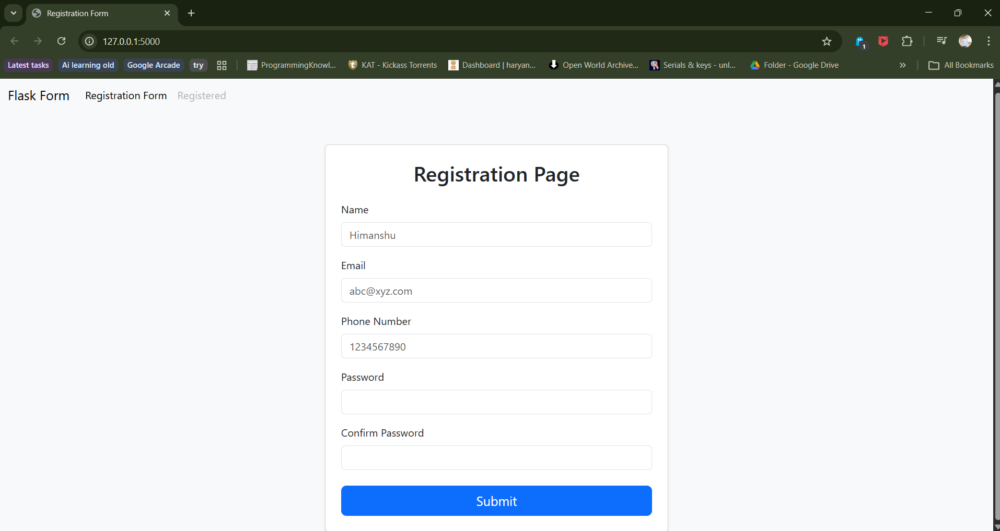
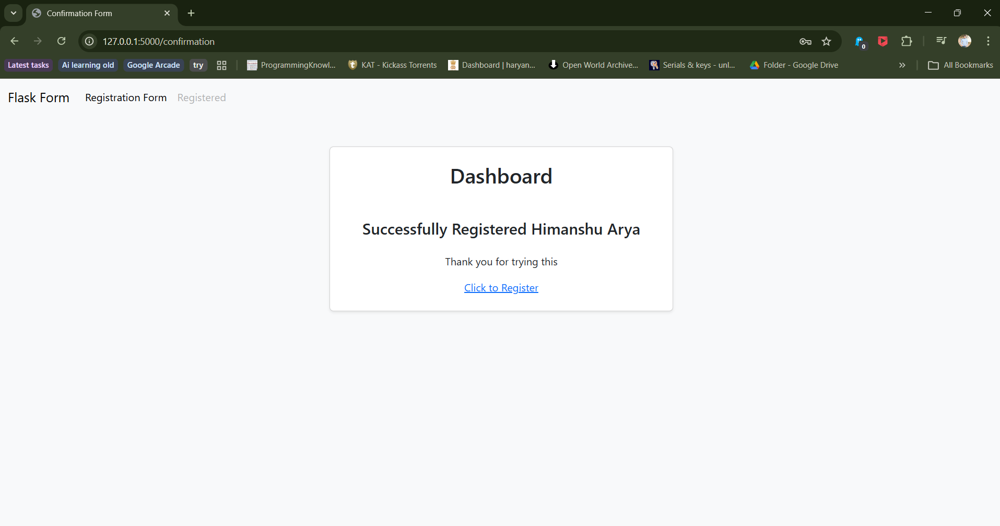

# Assignment 8: Flask Registration Form Project

## Flask - Registration Form Project

A complete web-based registration form application built using Flask framework with Bootstrap 5 styling, form validation, and template inheritance.

---

## 📌 Project Overview

### Description
A fully functional registration form web application that allows users to register with their details including name, email, phone number and password. The application includes real-time password validation, Bootstrap styling, and a confirmation dashboard upon successful registration.

### Features
- ✨ Clean and responsive UI using Bootstrap 5
- 📝 Registration form with multiple input fields (Name, Email, Phone, Password)
- 🔒 Real-time password match validation using JavaScript
- ✅ Server-side password confirmation check
- 🎨 Template inheritance with base layout
- 🔗 Navigation bar with hyperlinks
- 📱 Mobile responsive design
- 🎉 Personalized confirmation dashboard after registration

---

## 📂 Project Structure
```
assignment8/
├── registration_form.py        # Main Flask application
├── templates/
│   ├── base.html              # Base template with navbar and Bootstrap
│   ├── index.html             # Registration form page
│   └── confirmation.html      # Success confirmation page
├── screenshots/
│   ├── registration_form.png
│   └── confirmation_page.png
└── README.md                  # This documentation file
```

---

## 🚀 How to Run

### Prerequisites
- Python 3.x installed
- Flask framework

### Installation Steps

1. **Install Flask**:
```bash
pip install flask
```

2. **Run the application**:
```bash
python registration_form.py
```

3. **Open in browser**:
```
http://127.0.0.1:5000
```

---

## 💻 How It Works

1. **Home Page** (`/`): Displays the registration form with input fields
2. **Fill the Form**: Enter Name, Email, Phone Number, Password and Confirm Password
3. **Real-time Validation**: JavaScript checks if passwords match as you type
4. **Submit**: Form data is sent via POST request to `/confirmation`
5. **Server Validation**: Flask checks if passwords match server-side
6. **Confirmation Page** (`/confirmation`): Shows a personalized dashboard with success message

---

## 📸 Screenshots

### Registration Form


*Registration page with Name, Email, Phone Number, Password and Confirm Password fields*

---

### Confirmation Page


*Personalized dashboard shown after successful registration*

---

## 🛠️ Technologies Used

- **Python 3.x**
- **Flask** - Web framework
- **Jinja2** - Template engine
- **Bootstrap 5.3.8** - CSS framework for styling
- **HTML5** - Page structure
- **CSS3** - Custom styling
- **JavaScript** - Real-time password validation

---

## 🔧 Application Routes

| Route | Method | Description |
|-------|--------|-------------|
| `/` | GET | Renders the registration form |
| `/confirmation` | POST | Validates form data and renders confirmation page |

---

## 🔑 Key Concepts Implemented

### Flask Fundamentals
- Flask application setup and initialization
- Route creation with `@app.route()`
- Handling GET and POST methods
- `render_template()` for rendering HTML files
- `redirect()` and `url_for()` for navigation
- `request.form.get()` for accessing form data
- Debug mode with `app.run(debug=True)`

### Template Features
- Template inheritance using `` and ``
- Dynamic content rendering with `{{ variable }}`
- Reusable base template with navbar and Bootstrap

### Form Handling
- HTML form with POST method
- Multiple input types: text, email, tel, password
- Required field validation
- Server-side password match validation (400 error if mismatch)
- Client-side real-time password validation with JavaScript

### Styling
- Bootstrap 5 integration via CDN
- Responsive card layout with shadow
- Custom CSS for background and button colors
- Mobile-friendly responsive design

---

## 💡 Learning Objectives

- Setting up and running a Flask web application
- Creating and managing URL routes
- Rendering HTML templates with Jinja2
- Implementing template inheritance for code reusability
- Handling HTML form submissions (GET/POST)
- Accessing and processing form data in Flask
- Client-side form validation with JavaScript
- Integrating Bootstrap 5 for responsive design
- Using `redirect()` and `url_for()` for navigation
- Serving a complete multi-page web application

---

## 📁 Files

- `registration_form.py` - Main Flask application with route definitions
- `templates/base.html` - Base template with Bootstrap CDN, navbar and block structure
- `templates/index.html` - Registration form with JavaScript password validation
- `templates/confirmation.html` - Confirmation dashboard with personalized message
- `README.md` - This documentation file
- `screenshots/` - Folder containing application screenshots

---

## 👤 Author

[Himanshu Arya]
Created as part of the TuteDude Python Programming Course

---

## 📄 License

This project is for educational purposes as part of the TuteDude Python course.